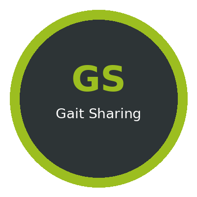
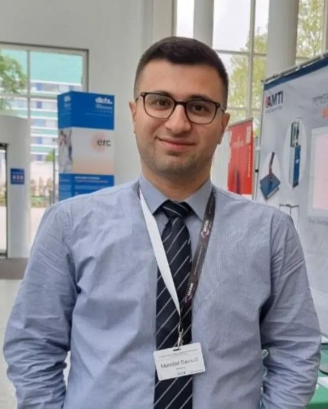

Gait Sharing
============

|

**Gait Sharing** is a free, open-source toolkit designed to facilitate data management and decision-making in clinical gait analysis.

It provides a complete pipeline from raw clinical data to AI-assisted gait interpretation, covering data import, patient management, anonymization, biomechanical feature extraction, and LLM-based reporting.

About the Author
-----------------

**Mehrdad Davoudi** — University Children's Hospital Basel (UKBB), Basel, Switzerland

Mehrdad Davoudi received his master's degree in mechanical engineering from Sharif University of Technology in Iran and conducted his research in electromyographic signal processing for patients with cerebral palsy at Heidelberg University Hospital in Germany. He accepted a short-term research associate position at the Children's Hospital in Basel, Switzerland, during his transition phase to continue his journey in biomechanics.

.. raw:: html

   

    

Getting Started
---------------

The toolkit has been developed with **Python 3.13**. Although Python 3.14 is available, the ``ezc3d`` library does not yet provide pre-built wheels for this version. Therefore, Python 3.13 is recommended to ensure full compatibility with all dependencies.

.. code-block:: bash

   pip install -r requirements.txt
   python GaitSharing_main.py

See :doc:`pages/installation` for detailed setup instructions.

Pipeline Overview
-----------------

.. list-table::
   :widths: 5 25 70
   :header-rows: 1

   * - Step
     - Module
     - Description
   * - 1
     - :doc:`pages/import`
     - Import patient data from existing lab databases
   * - 2
     - :doc:`pages/patients`
     - View, edit, and manage patient records
   * - 3
     - :doc:`pages/search`
     - Filter patients by clinical criteria
   * - 4
     - :doc:`pages/export`
     - Create secondary databases for research
   * - 5
     - :doc:`pages/anonymizer`
     - Anonymize clinical reports for sharing
   * - 6
     - :doc:`pages/c3d_extractor`
     - Extract gait data from C3D files to Excel
   * - 7
     - :doc:`pages/stride_analysis`
     - Segment gait cycles into individual strides
   * - 8
     - :doc:`pages/feature_extraction`
     - Compute biomechanical features per stride
   * - 9
     - :doc:`pages/ai_interpreter`
     - Generate AI-assisted gait reports

.. toctree::
   :maxdepth: 2
   :caption: User Guide
   :hidden:

   pages/installation
   pages/import
   pages/patients
   pages/search
   pages/export
   pages/anonymizer

.. toctree::
   :maxdepth: 2
   :caption: Analysis Pipeline
   :hidden:

   pages/c3d_extractor
   pages/stride_analysis
   pages/feature_extraction

.. toctree::
   :maxdepth: 2
   :caption: AI Interpretation
   :hidden:

   pages/ai_interpreter
   pages/outputs

.. toctree::
   :maxdepth: 1
   :caption: Reference
   :hidden:

   pages/requirements
   pages/contact
